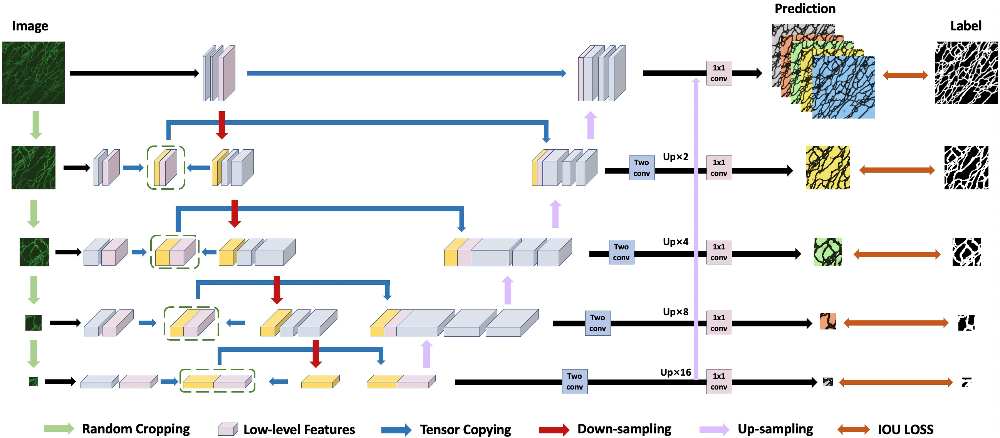

# Accurate Segmentation for Intracellular Organelle Networks based on Low-level features and Primary Structure Invariance

*Yaoru Luo, Yuanhao Guo, Jiaxing Huang, Wenjing Li, and Ge Yang*

Y. Luo, Y. Guo and J. Huang contributed equally to this work. 

A PyTorch implementation of MHC-Net based on the paper  _**Accurate Segmentation for Intracellular Organelle Networks based on Low-level features and Primary Structure Invariance**_.



Contact: *Jiaxing Huang* huangjiaxing2021@ia.ac.cn.

If you have any questions, please feel free to contact us!

## Dataset

To develop deep learning segmentation models, we construct two custom image datasets: ER and MITO, for the ER network and the mitochondrial network, respectively. To test the generalization capability of our deep learning models, we also use two public datasets of the retinal blood vessel network: DRIVE and STARE.

### Preparing Dataset

Please generate ".txt" files for train data and test data separately. In the ".txt" file, each line consists of the path of image and mask corresponding to the image.

For example:

```
/datasets/directory/train_mito.txt
	└── .../MITO/train/images/20_h384_w384.tif .../MITO/train/masks/20_h384_w384.tif
/datasets/directory/test_mito.txt
	└── .../MITO/test/images/20_h384_w384.tif .../MITO/test/masks/20_h384_w384.tif
```

## Setup

Setting up for this project.

### Installing dependencies

To install all the dependencies, please run the following:

```
pip install -r requirements.txt or conda install --yes --file requirements.txt
```

## Running MHC-Net

### Training

In this project, we used five models UNet, UNet++, HRNet, DeeplabV3+ and MHC-Net in the experimental phase. To facilitate the training of the different models, we created five different training files.

Below lines will run the training code with default setting in the file.

```
python train_deeplab.py
python train_hrnet.py
python train_mhcnet.py
python train_unet.py
python train_unet_plus.py
```

### Inference

In order to obtain segmentation results and evaluate model's performance under different thresholds, you can run the following line: 

```
Set up
 model_choice = ['unet', 'unetPlus', 'deeplab', 'MHCnet_Single_Loss','MHCnet_Up_Sampling_Loss',
                 'MHCnet_Multi_Layer_Loss','MHCnet_Hierarchical_Fusing_Loss']
 dataset_list = ['er', 'retina', 'mito', 'stare']
 txt_choice = ['test_drive.txt', 'train_drive.txt', 'train_mito.txt', 'test_mito_cbmi.txt', 'train_er.txt',
                  'test_er.txt', 'test_stare.txt', 'train_stare.txt']
Run 
 python inference.py
```

## Citation

If you find MHC-Net useful in your research, please consider citing:

```
TODO
```

## Acknowledgements

This work was supported in part by the National Natural Science Foundation of China (grant 91954201 under the major research program “Organellar interactome for cellular homeostasis” and grant 31971289) and the Strategic Priority Research Program of the Chinese Academy of Sciences (grant XDB37040402). (*Corresponding author: Ge Yang*). 
